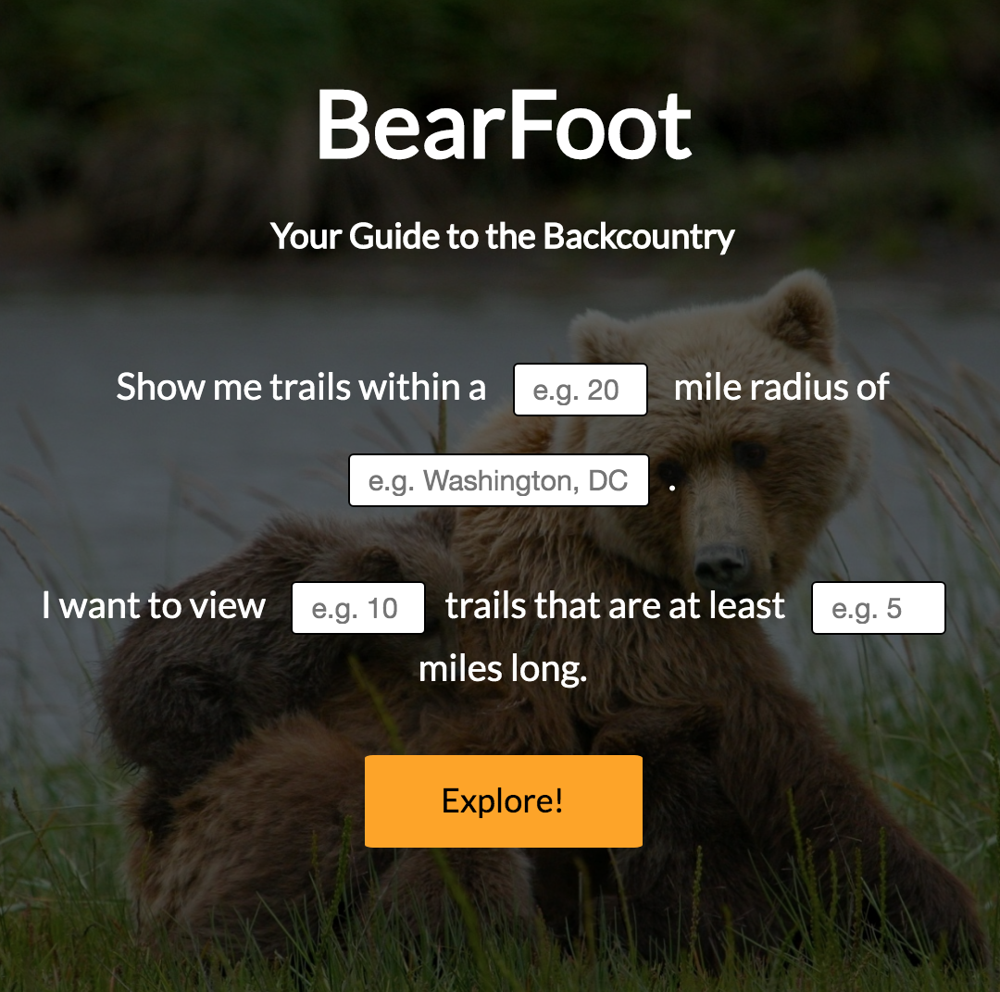
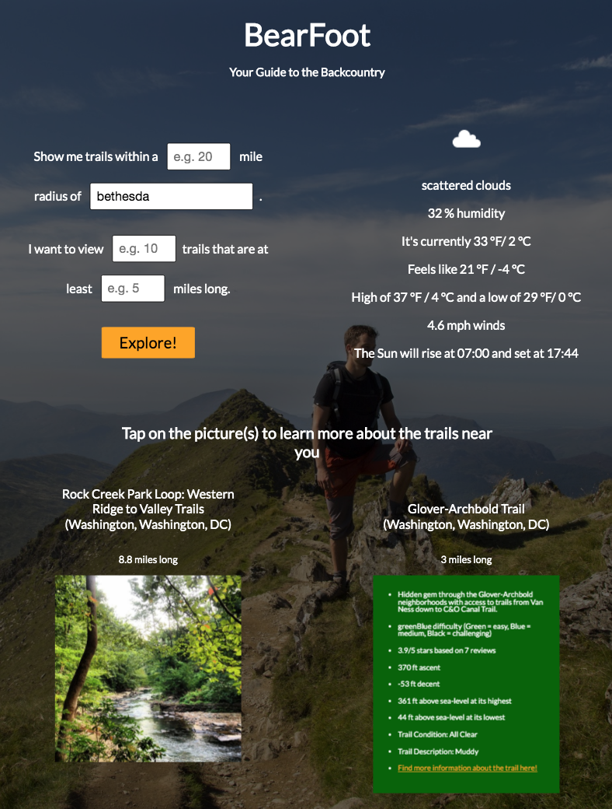

BearFoot:
Your Guide to the Back Country

BearFoot is an app shows the amazing hiking trails and green spaces anywhere in the United States

It uses jQuery, Javascript, CSS, and HTML5 to fetch various API's to show you different hiking trails near you and their subsequent environmental condition.

Made by Chris Aragon, with special help from Jaina Morgan, Matt Condit, and Daniel Levine

APIs courtesy of The Hiking Project, MapQuest API, IpGeolocation (https://ipgeolocation.io/) and the Openweather API (https://openweathermap.org/api)

repo: https://github.com/craragon77/hiking-program

live-link: https://craragon77.github.io/hiking-program/

